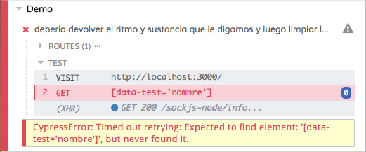

# Testeando el `ritmosustanciometro`
Para empezar a estilar nuestro `ritmosustanciometro` vamos a:

1. Agregar `Cypress` a nuestro proyecto
2. Agregar un `script` para abrir `Cypress` en nuestro `package.json`
3. Ejecutar el `script` por primera vez
4. Crear nuestro primer test
5. Ejecutar nuestro primer test

### Agregar `Cypress` a nuestro proyecto
Vamos a volver a la terminal, nos paramos en la carpeta `ritmosustanciometro` y ejecutamos:
```bash
npm install cypress --save-dev
```
Esperamos que termine de instalar y listo!

### Agregar un `script` para abrir `Cypress` en nuestro `package.json`
Vamos a nuestro `package.json` y agregamos un nuevo script `cypress:open` (o el nombre que quieras), al final de todo:
```javascript
"scripts": {
  ...
  "cypress:open": "cypress open"
}
```

### Ejecutar el `script` por primera vez
Una vez agregado ejecutamos en consola:
```bash
npm run cypress:open
```

## Crear nuestro primer test
Cuando queremos testear nuestra aplicación, muchas veces tenemos que hacer algo super tedioso que es encontrar una manera de resolver los pedidos que nuestra aplicación hace al servidor, ya sea por que no queremos spamear el server, no queremos llenar la base de datos de información de tests, etc. Por suerte `Cypress` tiene una muy buena solución a esto, vamos a crear un archivo `ritmosustanciometro.test.js` en la carpeta `cypress/integration` que se creó luego de correr el script  `cypress:open` por primera vez, dentro vamos a escribir:
```javascript
describe("Demo", () => {
  // Este hack es necesario por que Cypress no se lleva muy bien con el fetch nativo del browser, con suerte no lo vamos a necesitar en un futuro, básicamente reemplaza el fetch nativo por null para poder reemplazarlo con el fetch de cypress, esto va a servir para poder decidir que van a devolver nuestros calls http, si en tu aplicación no estas usando el fetch nativo del browser y estás usando request, axios, jQuery u otra alternativa, podes omitir el hook `before`
  before(function() {
    Cypress.on("window:before:load", win => {
      win.fetch = null;
    });
  });

  it("debería devolver el ritmo y sustancia que le digamos", () => {
    cy.server(); // Le decimos a Cypress que vamos a hacer uso de su server
    cy.visit("http://localhost:3000/"); // Le decimos a Cypress que vaya al inicio de nuestra aplicación, en este caso suponemos que la aplicación esta corriendo en la URL `http://localhost:3000/`

    cy.route("GET", "/obtener-ritmosustancia", 100); // Le decimos a Cypress que la próxima vez que nuestra aplicación haga un pedido a una url que termine con `obtener-ritmo-y-sustancia`, la respuesta siempre sea 100

    cy.get("[data-test='nombre']") // Obtenemos el campo de nombre
      .type('fcc{enter}') // Escribimos fcc y forzamos un enter

    cy.contains("fcc: 100"); // Esperamos que nuestra aplicación tenga "fcc: 100" impreso en alguna parte
  });
});
```
> Tip: Recordar que hay que tener la aplicación corriendo en `http://localhost:3000` sino el test no va a funcionar



Mmm, nuestro test falla, nos dice que no encuentra el elemento `[data-test='nombre']`. Eso es por que es verdad, ese elemento no existe (todavía), los elementos `data-test` se suelen utilizar para poder obtener los elementos deseados de una aplicación, desde los tests. Vamos a ir a nuestra aplicación y en `App.js` vamos a agregarle `[data-test='nombre']` a nuestro campo de texto `nombre`:
```jsx
...
<input type="text" data-test="nombre" onChange={actualizarNombre} value={nombre} />
...
```
Ahora vemos que nuestro test pasa!


### Conclusión
Tenemos nuestra aplicación creada, estilada y testeada, felicitaciones!
Ahora te invito a volver al inicio a hacer los ejercicios

[⏪ Estilando el `ritmosustanciometro`](./03-estilar-ritmosustanciometro.md) | [Inicio ⏩](../../README.md)
