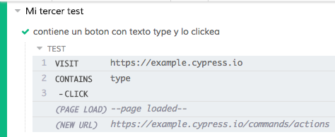
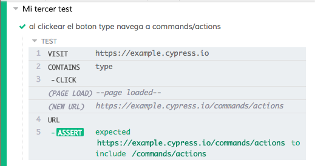
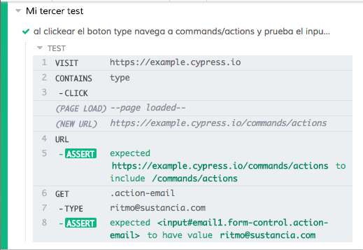

# `Cypress`? Se aspira?
* Framework de testing
* API fácil
* Tiene modo de interfaz gráfica
* Muchos features opcionales útiles
* Se puede testear cualquier cosa que corra en un navegador

## Como empiezo con `Cypress`?
Algo muy importante que tiene `Cypress` es lo fácil que es empezar a escribir nuestros tests (y lo fácil que son de escribir), veamos como empezar.

- Instalación

```bash
npm install cypress --save-dev
```

- Ejecución

Vamos a nuestro `package.json` y modificamos/creamos el script `test` con el comando `cypress open`:
```javascript
"scripts": {
  ...
  "test": "cypress open"
}
```
Una vez agregado ejecutamos en consola:
```bash
npm test
```

## Escribiendo nuestro primer test
Una vez que ejecutamos `Cypress` por primera vez, vamos a ver que se creó una nueva carpeta `cypress` en nuestro proyecto, vamos a crear un nuevo archivo `demo.test.js` en `cypress/integration` y dentro vamos a poner:
```javascript
describe('Mi primer test', function() {
  it('true es igual a true', function() {
    expect(true).to.equal(true)
  })
})
```


Una vez que ejecutemos esto, vamos a la ventana de `Cypress` y vamos a ver que esta nuestro nuevo archivo `demo.test.js`, vamos a ejecutarlo y vemos que nuestro test pasa!

Ahora solo para testear que `Cypress` funciona correctamente vamos a modificar nuestro test para que falle:
```javascript
describe('Mi primer test', function() {
  it('true es igual a true', function() {
    expect(true).to.equal(false)
  })
})
```


Si vemos que falla sabemos que `Cypress` está funcionando y configurado correctamente para que empecemos a escribir nuestros verdaderos tests.
`Cypress` además implementa algunas librerias externas, por ejemplo, `expect` es de la librería [Chai](http://chaijs.com/) y `describe` e `it` son de la librería [Mocha](https://mochajs.org/)

## Visitando una página
Una de las primeras cosas que necesitamos hacer para testear nuestra aplicación es entrar a la `url` de la misma, para eso podemos usar la función `cy.visit`. Para este ejemplo vamos a usar la [aplicación de prueba](https://example.cypress.io) de `Cypress`. Vamos a agregar un nuevo test a `demo.test.js`:
```javascript
describe('Mi segundo test', function() {
  it('visita la aplicación de prueba', function() {
    cy.visit('https://example.cypress.io')
  })
})
```


Una vez que hacemos esto nos dirigimos a la ventana de `Cypress` y podemos ver en el listado de la izquierda la acción `VISIT`, si la `url` que ingresamos en `cy.visit` devuelve una respuesta de `status` `404` o `500` el test hubiera fallado

## Obteniendo un elemento
Para obtener un elemento desde `Cypress` tenemos muchas alternativas, una de las mas convenientes para tests rápidos puede ser `cy.contains`, que simplemente busca un elemento que posea ese contenido. Vamos a agregar un nuevo test buscando un elemento que posea `type` en su contenido:
```javascript
describe('Mi tercer test', function() {
  it('contiene un boton con texto type', function() {
    cy.visit('https://example.cypress.io')

    cy.contains('type')
  })
})
```


Vemos que nuestro test pasa aunque no hayamos declarado ningún `expect` o `assert`, eso es por que muchos de los comandos de `Cypress` están preparados para eso, si no se hubiera encontrado un elemento con contenido `type`, el test hubiera fallado

## Clickear un elemento
Como podríamos hacer para clickear el botón que contenía `type` del test anterior? Muy simple:
```javascript
describe('Mi tercer test', function() {
  it('contiene un boton con texto type y lo clickea', function() {
    cy.visit('https://example.cypress.io')

    cy.contains('type').click()
  })
})
```



De esta manera podemos ir leyendo nuestros tests como una historia e ir esperando los resultados deseados

## Hacer un `assertion`
Nosotros sabemos que al clickear manualmente el botón type, la `url` de nuestra app va a cambiar, vamos a testear que eso funcione correctamente con `cy.url` y `should`:
```javascript
describe('Mi tercer test', function() {
  it('al clickear el boton type navega a commands/actions', function() {
    cy.visit('https://example.cypress.io')

    cy.contains('type').click()

    cy.url().should('include', '/commands/actions')
  })
})
```



## Escribir en un input
Por último, vamos a chequear que los inputs de texto andan correctamente:
```javascript
describe('Mi tercer test', function() {
  it('al clickear el boton type navega a commands/actions y prueba el input de mail', function() {
    cy.visit('https://example.cypress.io')

    cy.contains('type').click()

    cy.url().should('include', '/commands/actions')

    cy.get('.action-email')
      .type('ritmo@sustancia.com')
      .should('have.value', 'ritmo@sustancia.com')
  })
})
```



## Extras que no vamos a ver en este curso
Lo que vimos recién no es nada comparado a lo que se puede hacer, si quieren seguir un poco más este ejemplo que estuvimos viendo, pueden hacerlo en [la página oficial de `Cypress`](https://docs.cypress.io/guides/getting-started/writing-your-first-test.html#Adding-More-Commands-and-Assertions)

* [Fixtures](https://docs.cypress.io/api/commands/fixture.html) nos permite devolver archivos completos o ejecutar funciones como respuesta de un pedido de servidor.
* [Configuración de ambientes](https://docs.cypress.io/api/plugins/configuration-api.html#) nos permite correr nuestros tests con diferentes configuraciones dependiendo que ambiente queramos testear.
* [Buenas prácticas](https://docs.cypress.io/guides/references/best-practices.html) de `Cypress`.

## Conclusión
Con esto ya tendríamos prácticamente todo testeado, ahora solo tenemos que hacer nuestra aplicación!

[⏪ Styled Components](./styled-components.md) | [Creando nuestra aplicación base ⏩](../steps/01-crear-base.md)
